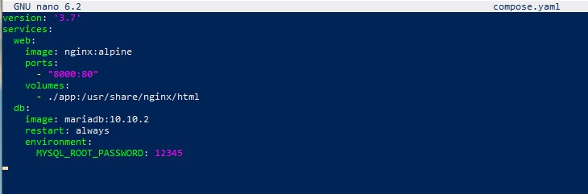
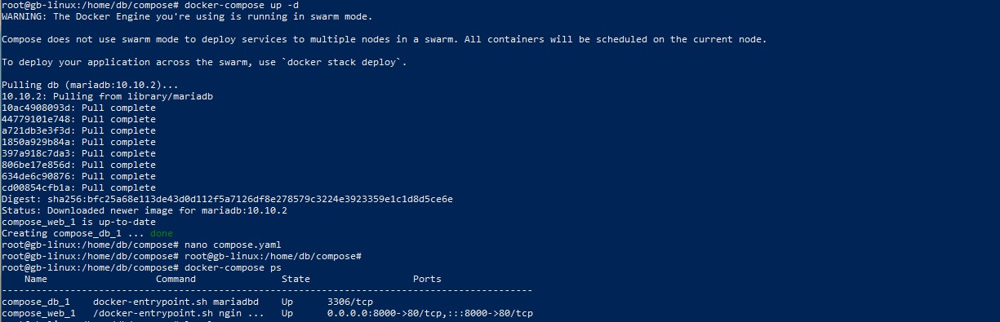

Создаем директорию "compose" и переходим в неё:
mkdir compose

cd compose

В данной директории создаем файл "compose.yaml" и меняем его содержимое:
nano compose.yaml

Создаем сервис из 2-х контейнеров (web и db)

Запуск Docker Compose:
docker-compose up -d

Проверяем активность контейнера

docker-compose ps

